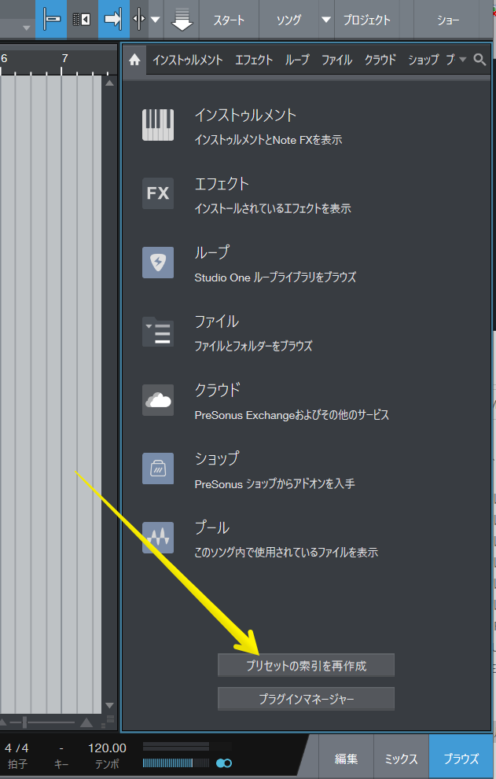

# Articulation Mapping files

DAW毎にあるキースイッチ機能の定義ファイルを公開しています。

## 対応フォーマット

以下のファイル形式に対応しています。

- Cubase / Nuendo
    - VST Expression map (*.expressionmap)
- Studio One 5.2~
    - Sound Variation file (*.keyswitch)
- Cakewalk
    - Articulation map file (*.artmap)

## Studio One 5 ユーザーの方へ

恐らく以下のフォルダがあるはずなので、ダウンロード後、ファイルを置いてください。

- Windows: `C:\Users\<USERNAME>\Documents\Studio One\Presets\User Presets\Key Switches`
- Mac: `/Users/<USERNAME>/Documents/Studio One/Presets/User Presets\Key Switches`

その後、プリセットの索引を再生成してください。

## これらのファイルは...

- 自作のツールでDAW毎のファイルを生成しています。
- オフィシャルサイトのミラーリング (**NOTICE** ファイル参照)
- オフィシャルサイトで過去に配布していたファイル (**NOTICE** ファイル参照)

## 生成ツールについて

- 興味があれば [こちら](https://github.com/r-koubou/KeySwitchManager) からダウンロード、キースイッチのデータベースファイル（KeySwitches.db）を編集することが可能です。

### ライセンス

MIT License