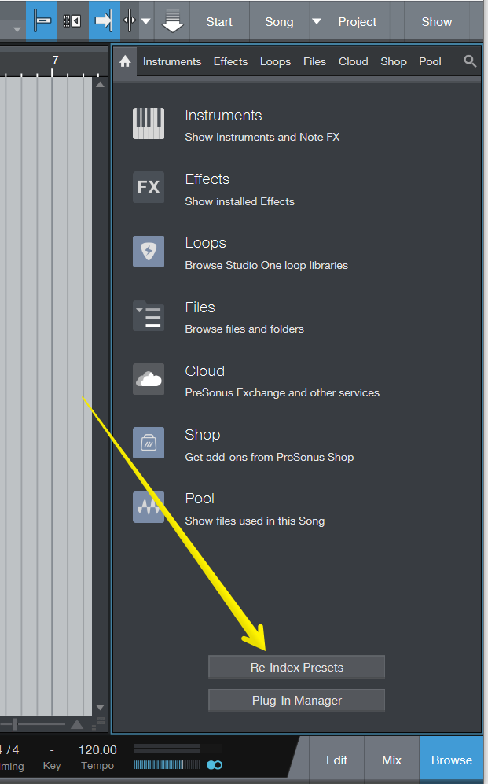

Studio One / Studio Pro
=======================

You will probably have the following folder, so put the file down after you download it.

## Studio One

- Windows: `C:\Users\<USERNAME>\Documents\Studio One\Presets\User Presets\Key Switches`
- macOS: `/Users/<USERNAME>/Documents/Studio One/Presets/User Presets\Key Switches`

## Studio Pro

- Windows: `C:\Users\<USERNAME>\Documents\Studio Pro\Presets\User Presets\Key Switches`
- macOS: `/Users/<USERNAME>/Documents/Studio Pro/Presets/User Presets\Key Switches`

## Applying the changes

Regenerate the index of the presets if they don't show files.

